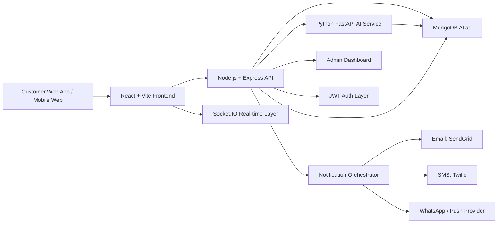
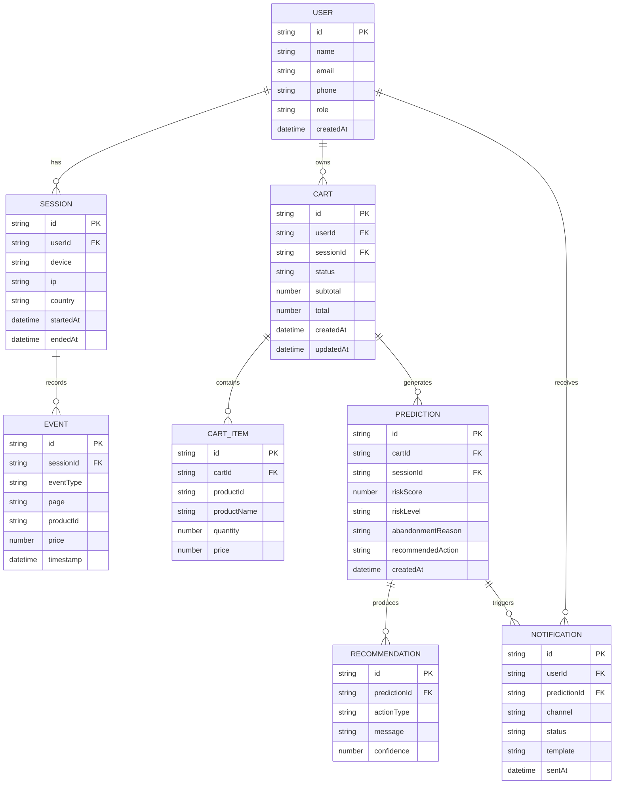
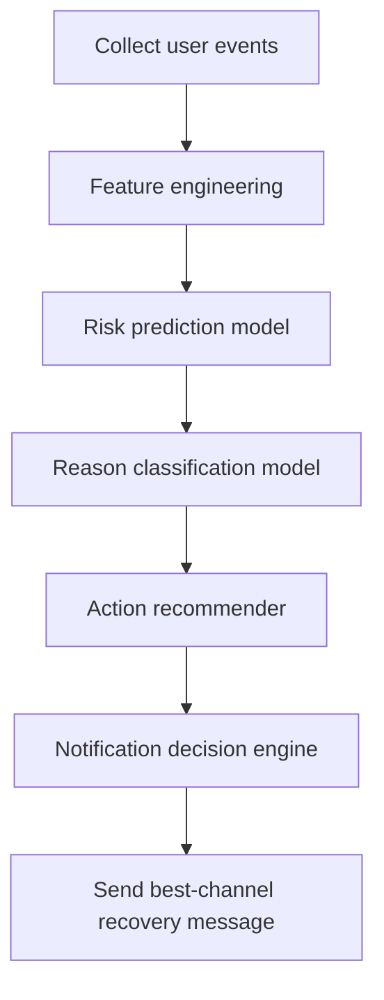

# CartRescue AI – Intelligent Cart Abandonment Prediction & Recovery Platform

## 1. Complete System Architecture

### High-level architecture



### Core components

- Frontend
  - React + Vite for customer experience
  - Material UI for polished UI
  - Session tracking snippet for browser events
  - Socket.IO client for live risk updates

- Backend API
  - Node.js + Express for authentication, business logic, and API orchestration
  - JWT for user/session protection
  - REST APIs for carts, sessions, predictions, notifications, admin analytics

- AI Service
  - Python FastAPI for risk scoring, reason detection, and recommendation engine
  - Receives browser events and cart lifecycle data from the Node service
  - Returns prediction + recommended recovery action

- Data Layer
  - MongoDB Atlas for flexible document storage
  - Collections for users, sessions, carts, events, predictions, notifications, and analytics

- Notification Layer
  - SendGrid for email
  - Twilio for SMS/WhatsApp
  - Push notification provider for browser/mobile push
  - Notification rules based on risk score and inferred reason

- Admin Dashboard
  - Analytics view for abandonment rate, risk breakdown, channel performance, and recovery conversion

---

## 2. Folder Structure

```text
cartrescue-ai/
├─ client/                     # React + Vite frontend
│  ├─ src/
│  │  ├─ components/
│  │  ├─ pages/
│  │  ├─ hooks/
│  │  ├─ services/
│  │  ├─ contexts/
│  │  ├─ styles/
│  │  └─ utils/
│  └─ package.json
│
├─ server/                     # Node.js + Express API
│  ├─ src/
│  │  ├─ controllers/
│  │  ├─ routes/
│  │  ├─ middleware/
│  │  ├─ services/
│  │  ├─ models/
│  │  ├─ repositories/
│  │  ├─ sockets/
│  │  ├─ config/
│  │  └─ utils/
│  └─ package.json
│
├─ ai-service/                 # Python FastAPI AI service
│  ├─ app/
│  │  ├─ api/
│  │  ├─ models/
│  │  ├─ services/
│  │  ├─ pipelines/
│  │  ├─ schemas/
│  │  └─ utils/
│  └─ requirements.txt
│
├─ shared/                     # Shared DTOs / constants / validators
│  └─ types/
│
├─ docs/                       # Architecture, API, roadmap docs
├─ scripts/                    # Seed data, deployment helpers
├─ .env.example
├─ docker-compose.yml
└─ README.md
```

---

## 3. Database ER Diagram



### Recommended Mongo collections

- users
- sessions
- events
- carts
- cartItems
- predictions
- recommendations
- notifications
- adminMetrics

---

## 4. API Architecture

### API layers

- Auth API
  - POST /auth/register
  - POST /auth/login
  - POST /auth/refresh
  - GET /auth/me

- Session & Behavior API
  - POST /sessions/start
  - POST /sessions/heartbeat
  - POST /events
  - GET /sessions/:id/summary

- Cart API
  - POST /carts
  - GET /carts/:id
  - PATCH /carts/:id
  - POST /carts/:id/items
  - DELETE /carts/:id/items/:itemId

- Prediction API
  - POST /predictions/score
  - GET /predictions/:cartId/latest
  - GET /predictions/history

- Notification API
  - POST /notifications/send
  - GET /notifications/:userId
  - PATCH /notifications/:id/status

- Admin API
  - GET /admin/analytics/overview
  - GET /admin/analytics/risk-breakdown
  - GET /admin/analytics/channel-performance

### Real-time events via Socket.IO

- socket.emit("risk-update")
- socket.emit("recovery-triggered")
- socket.emit("admin-analytics-update")

### Suggested service boundaries

- Auth Service
- Session Tracking Service
- Cart Service
- Prediction Orchestrator
- Notification Service
- Admin Analytics Service

---

## 5. AI Workflow



### AI pipeline

1. Data ingestion
   - Capture page views, time on page, product interactions, cart updates, exit intent, and dwell time

2. Feature engineering
   - Session duration
   - Number of product views
   - Cart value volatility
   - Add-to-cart -> checkout dropoff ratio
   - Time since last interaction
   - Device and geolocation signals

3. Risk model
   - Classify as low / medium / high abandonment risk
   - Use a lightweight supervised model such as XGBoost or Logistic Regression

4. Reason detection
   - Identify likely causes: price concern, shipping friction, trust issue, comparison shopping, device issue, payment friction

5. Recommendation engine
   - Instead of blanket discounts, recommend actions like:
     - Offer free shipping when shipping friction is detected
     - Show trust badges when trust concern is inferred
     - Trigger a support assistant when checkout anxiety appears
     - Send a reminder when the user has simply been distracted

6. Channel selection
   - Email for longer purchase cycles
   - SMS for high-intent, short window situations
   - WhatsApp for engaged mobile users
   - Push for active browser sessions

### Recommended AI model stack

- Model 1: risk prediction
- Model 2: reason classifier
- Model 3: action recommender (rule-based + ML hybrid)

> For a hackathon, a hybrid approach works best: heuristic rules + a simple ML classifier for risk scoring.

---

## 6. Development Roadmap

### Phase 1 – Foundation (Days 1–3)

- Set up React + Vite frontend
- Set up Node.js + Express backend
- Configure MongoDB Atlas
- Implement JWT auth
- Create session tracking event schema

### Phase 2 – Core Product (Days 4–7)

- Build cart lifecycle APIs
- Add session event ingestion
- Create admin dashboard skeleton
- Set up Socket.IO for live updates

### Phase 3 – AI Integration (Days 8–10)

- Build FastAPI service
- Develop risk scoring endpoint
- Add reason classifier and action recommender
- Connect backend to AI service

### Phase 4 – Recovery & Notifications (Days 11–13)

- Add Email/SMS/WhatsApp/push logic
- Build notification templates
- Implement smart channel selection rules

### Phase 5 – Analytics & Polish (Days 14–15)

- Admin analytics charts
- Dashboard filters and export options
- Demo flow optimization
- Security and error handling

### Suggested hackathon demo flow

1. User browses products
2. Session is tracked in real time
3. AI predicts abandonment risk
4. System identifies likely reason
5. Recovery action is recommended
6. Notification is sent through best channel
7. Admin sees impact in dashboard

---

## 7. Recommended Project Structure

### Monorepo approach

Use a monorepo for faster development and shared contracts:

```text
root/
├─ apps/
│  ├─ web/                 # customer-facing app
│  ├─ admin/               # admin dashboard
│  └─ mobile/              # optional future mobile app
├─ services/
│  ├─ api/                 # Node.js backend
│  ├─ ai/                  # Python FastAPI service
│  └─ notifier/            # notification worker
├─ packages/
│  ├─ ui/                  # shared UI components
│  ├─ shared/              # schemas and utilities
│  └─ config/              # env and common config
```

### Why this is ideal for a hackathon

- Faster iteration across frontend and backend
- Shared types and DTOs reduce bugs
- Easier deployment and demo setup

---

## 8. Best Design Patterns

### Recommended patterns

- Repository Pattern
  - Keeps MongoDB access logic separate from business logic

- Service Layer Pattern
  - Business rules live in services, not controllers

- Strategy Pattern
  - Use different notification strategies for email, SMS, WhatsApp, and push

- Factory Pattern
  - Create different recovery actions or channel handlers dynamically

- Observer / Event-Driven Pattern
  - Session events and prediction updates can trigger downstream actions

- Middleware Pattern
  - JWT auth, error handling, request logging, and rate limiting

- Circuit Breaker Pattern
  - Protect the system when third-party channels like Twilio or SendGrid fail

### Suggested implementation conventions

- Controllers handle HTTP only
- Services contain business logic
- Repositories talk to MongoDB
- AI inference stays in the Python service
- Notification dispatch is asynchronous where possible

---

## Recommended MVP Scope

If you want a strong hackathon MVP, build only these first:

- User authentication
- Session tracking
- Cart event collection
- Risk score prediction
- One reason classifier
- One recovery action
- One notification channel
- Admin dashboard with simple analytics

That will be enough to demonstrate the full idea clearly.

---

## Final Recommendation

For this hackathon, the best architecture is:

- React + Vite frontend
- Node.js + Express for core app logic
- Python FastAPI for AI inference
- MongoDB Atlas for persistence
- Socket.IO for live updates
- SendGrid + Twilio for multi-channel recovery

This combination gives you a strong balance of speed, ease of demo, and real-world relevance.
